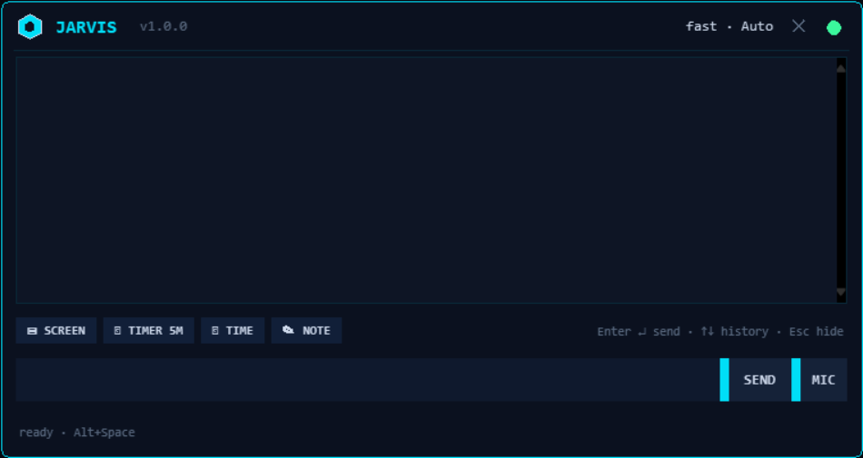

# JARVIS — Voice-first AI assistant for Windows


Talk to your PC and it obeys: **142 skills + 18 one-click library
packs, 30 LLM tools, 144 API endpoints.** Open and close apps by
name, dictate notes into
Obsidian, search and read the web, run VSCode and terminal tasks —
by voice, hotkey, or the `Alt+Space` HUD over any window. No API key?
It still boots in **skills-only mode** and tells you how to unlock
the rest.

A slim **Lite** build (32 skills, port 5002) lives next to it in
`../lite jarvis/`.

## Install (Windows, 3 steps)

**Step 1 — one line.** Paste into PowerShell *or* cmd, press Enter:

```bat
powershell -c "iex (irm https://raw.githubusercontent.com/Youssef-Devolopment/jarvis/main/setup.ps1)"
```

This clones the repo to `%USERPROFILE%\jarvis`, builds `.venv`,
installs every requirement group + Playwright Chromium, creates
`.env` from the template, then runs an 11-point health check.
Existing files are never touched; already have the repo? Run
`.\setup.ps1` from its folder instead.

**Step 2 — add your key (no files needed).** Start JARVIS once
(`desktop.bat` below), open **Settings → GENERAL**, paste
`DEEPSEEK_API_KEY`, SAVE+TEST. The key is verified live against
your provider (any OpenAI-compatible base URL works), saved to
`.env` with a backup, and chat unlocks immediately. Keyless? Skip
this — skills-only mode already answers 100+ local commands, and a
banner + a first-run card walk you through the rest.

**Step 3 — launch.**

```bat
cd %USERPROFILE%\jarvis
desktop.bat         :: tray icon + Ctrl+Alt+J + Alt+Space HUD (recommended)
start.bat           :: console server on http://127.0.0.1:5000
```

Say *"open notepad"*, *"what time is it"*, *"close chrome"*.
Press **Alt+Space** anywhere for the floating HUD.

Prefer it manual? `install.bat`, `copy .env.example .env`,
`start.bat` — same result, your hands on every step.

## What it can do

- **Talk** — chat bar, mic dictation (Groq), or HUD; skills answer
  first, the LLM fills the gaps (SSE stream, `POST /command`)
- **Open any app** — *"open discord"* resolves aliases, Start Menu,
  PATH and registry; unknown apps get deep-scanned (Program Files /
  LocalAppData / Start Menu / PATH), launched, and kept as a
  permanent instant skill. `GET /api/apps/learned`
- **Close any app** — *"close spotify"*: graceful first (apps may
  prompt to save), force only leftovers, verified gone. System
  processes and JARVIS itself are always refused.
  `POST /api/apps/close`
- **Tidy** — *"tidy"* reports stale temp files, *"tidy confirm"*
  removes them (in-use files skipped); nightly Dream runs clean
  automatically while you're away
- **Auto mode** — turn on *"auto approve skills"* and open/close
  run with zero prompts. Off = voice + toast confirm every time.
- **VSCode + terminal** — open files at line N, run sandboxed
  commands (`code run`, allow-listed folders, destructive commands
  blocked or confirmed), Code-Mode file ops, OpenCode agent tasks
- **Files + Obsidian** — explorer, folders, snippets, layouts;
  notes land in your Obsidian vault (or SQLite fallback),
  `/clip` and `/vault` from chat
- **Add anything** — *"remember https://x as docs"* pins sites
  (`open docs` works after), *"install mcp fetch"*, *"add frob
  as an app"*, *"add a skill that..."* — one router
  (`POST /api/add`) over every installer
- **Web** — tiered search (Tavily AI tier when keyed, Brave, DDG,
  Bing, SearxNG), fetch-and-read pages with Jina fallback,
  summaries, screenshots, WhatsApp / Gmail / Todoist
- **Research** — *"research <topic>"* fans out over live sources
  into a timestamped Markdown report (`docs/research/`), TL;DR
  included, summary remembered; async `POST /api/research`
- **Backup** — *"backup"* zips memory + keys to `logs/backups`
  (last 5 kept); agents that survive dead models via fallback chain
- **System + voice** — volume, brightness, lock, timers, todos,
  reminders, focus lock, Windows dark/light/transparency, Edge/Piper
  speech (engine pre-warmed at boot), multi-model councils,
  outcome memory, Dream Mode summaries, morning briefing
- **HUD + dashboard** — glassmorphism UI with mood-reactive accent;
  `Alt+Space` opens the rebuilt **HUD 4.0 glass command deck** —
  rounded transparent corners, compact input mode that expands into
  a scrollable reply well, replies that **stream token-by-token** as
  the model answers, pulsing status dot, hover chips, COPY —
  first boot gives a self-removing guided tour; a GETTING STARTED
  card stays until dismissed
- **Library (one click)** — Settings → LIBRARY: install any of 18
  bundled skill packs (passwords, calculators, ciphers…) or add any
  of 12 MCP servers (memory, filesystem, fetch, git, playwright…)
  with a single click; packs hot-load validated, MCP entries
  auto-start or tell you which API key to set — and **import your
  own packs as JSON**, with REMOVE / START / STOP per entry
- **Alerts that reach you** — desktop toast plus a green HUD pulse
  when timers, reminders, research jobs or computer tasks finish
- **Always up to date** — JARVIS checks GitHub at boot and fast-
  forwards itself to the newest version, but never over your local
  edits or unpushed commits; toggle in Settings → GENERAL, manual
  CHECK/UPDATE in Settings → ABOUT (`GET /api/update/check`)
- **System Guard** — a RAM watchdog that warns (once, with the top
  offender named) before the machine chokes, plus *"mic test"*
  pre-flight for dictation; toggle in Settings → GENERAL
- **Health dashboard** — `GET /api/health` reports every subsystem
  (config drift, key, memory schema + integrity check, voice,
  guard, updater, MCP, boot services) in one snapshot; Settings →
  **SYSTEM** renders it with RESTART/STOP buttons per service
  (`POST /api/services/<name>`), a page-wide banner flags
  warn/degraded states until they clear, ~20s after boot a
  `Health after boot:` line lands in `logs/jarvis.log`, and secrets
  are masked in the log by default
- **Workspace Orchestrator** — *"scaffold a flask project called
  X"* for 7 project kinds (git included), and *"append X to file Y"*
  / *"insert X after anchor"* with a `.bak` every time, allow-listed
  to safe roots (`POST /api/interleave`)
- **n8n Bridge** — automations POST to `/api/webhook/in` to store,
  speak or RUN actions through the skill router (token/localhost
  gated, off by default); *"send to n8n: …"* goes the other way
- **Deep Web Intelligence** — *"docs for X"* reads the real PyPI/
  GitHub docs and briefs them; *"explore X"* fans 4 queries across
  search tiers at once and returns one sourced answer

## Login autostart (power button)

Settings → Autostart **on** (or `POST /autostart/enable`) arms up to
**three independent triggers** so pressing the PC power button always
brings JARVIS up:

1. Startup shortcut `pythonw desktop.py --open`
2. `HKCU\...\CurrentVersion\Run` registry key (no admin needed)
3. Task Scheduler logon task, +15s (created when elevated)

Every boot starts silently, opens JARVIS in a new browser window,
and greets you with system uptime. The single-instance guard makes
a double-fire harmless. Status: `GET /autostart/status`.

## Screenshots

**Alt+Space overlay HUD** — one key away over any window:



> **▶ Demo:** press **Alt+Space** anywhere — the HUD fades in over the
> active window, speak or type, `Esc` (or Alt+Space again) dismisses it.

<!-- GIF placeholder: drop a recording at docs/overlay-demo.gif
     (record ~4s with Win+Alt+R: invoke HUD, ask "what time is it",
     Esc) and swap the callout above for:
     **▶ Demo:**  -->

## For builders

```
run.py / server.py / config.py      entry points + settings (.env)
ai/          LLM client, tools, agents, council backends, integrations
skills/      142 @register skills (+ skills/auto_generated/)
library/     one-click catalog: 18 skill packs + 12 MCP entries
             (library/user_catalog.json = your imports, gitignored)
voice/       Groq mic input, Piper/edge-tts output (Ryan)
memory/      SQLite facts, messages, prefs, outcomes, contacts, …
moods/       personalities, router, escalation levels, classifier
mcp/         client runtime, presets, native stdio MCP server
plugins/     community plugins (validated, isolated, MIT-replaceable)
system/      tray, hotkey, overlay, singleton, autostart, launcher,
             updater, guard (RAM watchdog), health (/api/health
             snapshot), services (one boot registry shared by both
             entry points), app_learner (scan + skills), app_close
             (kill by name)
routes/      Flask blueprints (144 endpoints)
static/ + templates/   web UI (LIFE/DEV modes, 30+ slash commands)
```

- `main` builds green: syntax-check every file + **530 unit tests**
  on Windows runners (`.github/workflows/ci.yml`)
- One broken skill file can never kill the boot: skill modules load
  isolated (failure logged, rest continue), handler crashes fall
  through to the next skill instead of failing the request
- No secrets in the repo — `.env`, `.env.bak`, runtime data and
  browser caches are gitignored; keys live only in your local `.env`
- Community-friendly: MIT license, issue/PR templates,
  `CONTRIBUTING.md`, `CODE_OF_CONDUCT.md`, `SECURITY.md`,
  `ARCHITECTURE.md`, `CHANGELOG.md`, `TESTING.md` (how the repo is
  verified), `DECISIONS.md` (why the architecture is shaped this
  way), `ROADMAP.md` (30/90-day direction), hot-reloadable `plugins/`
  with a validated template
- AI-continuable: `AGENTS.md` holds the full developer loop
  (layout, commands, constraints, verification) so any coding
  agent can pick up exactly here

## Config

Minimum: `DEEPSEEK_API_KEY` (any OpenAI-compatible base URL).
Optional: `GROQ_API_KEY` (mic), `BRAVE_API_KEY` (search tier),
`OBSIDIAN_VAULT` (notes to Markdown), `TODOIST_API_TOKEN`.
Full list with defaults: `.env.example`.

## Health

```bat
.venv\Scripts\python.exe check.py     :: 11 preflight checks
.venv\Scripts\python.exe -m unittest discover -s tests   :: 530 tests
```
